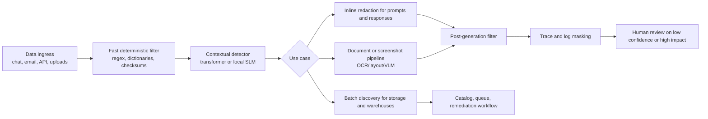
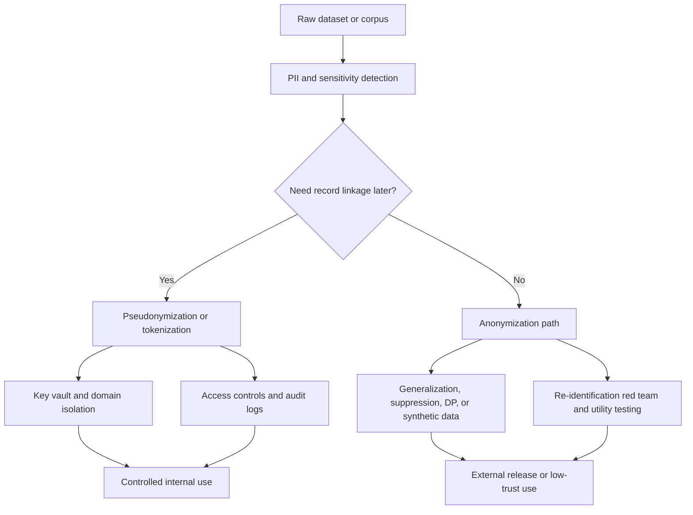

# PII Detection and Data Transformation in the Age of LLMs and Agentic Workflows

## Executive summary

Because the industry is unspecified, this report is cross-industry by design. The strongest public benchmark evidence still comes from healthcare and legal text, so several examples use those domains as proxies for the harder end of enterprise privacy work. The core pattern across recent literature and platform documentation is consistent: enterprises are moving from purely rule-based PII detection to hybrid stacks that combine deterministic patterns, domain dictionaries, task-specific transformer models, and selective use of LLMs or multimodal models. That shift is happening because direct identifiers are easy, but indirect, contextual, multilingual, and multimodal identifiers are not. Recent studies also show that generic LLMs are not yet reliable as a sole privacy control: they can over-redact, hallucinate, and miss ambiguous names or context-dependent PII even when overall benchmark scores look strong. citeturn22view0turn14search1turn22view1turn22view3turn16search14turn16search3

The strategic decision is not just “how do we detect PII,” but “what privacy state do we need after detection.” Anonymization and pseudonymization are different end states with different legal and operational implications. Under GDPR, pseudonymized data remains personal data, while effectively anonymized data falls outside data protection law; under HIPAA, Safe Harbor and Expert Determination are separate de-identification routes; under CCPA, “deidentified” information must not reasonably be linkable and requires organizational and contractual controls. In practice, when detector recall is uncertain, enterprises should avoid claiming “anonymization” for rich text, documents, logs, screenshots, or agent traces and should instead use pseudonymization plus access controls, audit logs, and residual-risk testing. citeturn34view0turn34view1turn8view0turn5view0turn3view0

LLMs and agentic workflows expand the privacy attack surface in three ways. First, they increase the amount of unstructured and multimodal data flowing into prompts, retrieval indexes, and tool calls. Second, they create new persistence layers such as traces, memory stores, evaluation corpora, and screenshots. Third, they introduce model-side risks such as memorization, inference-based attribute disclosure, and privacy failures under prompt injection or ambiguous language. Official agent and observability docs now explicitly warn that traces can capture sensitive prompts, tool inputs, and outputs; recent privacy papers show that training data extraction and attribute inference remain practical; and new benchmarks for computer-use agents show that screenshot-based PII detection is now a first-class requirement. citeturn30view0turn30view1turn30view2turn30view3turn29view0turn29view1turn28view0turn37search4

For most enterprises, the best default architecture is a layered one: local or tenant-isolated detection at ingress, retrieval-time sanitation, post-generation redaction, trace/log masking, and human review for low-confidence or high-impact cases. The best near-term product opportunity is not a monolithic “privacy AI,” but a policy-driven privacy control plane that can route data by use case: inline redaction for chat and copilots, reversible pseudonymization for workflow continuity, statistical anonymization or synthetic data for external release, and privacy red-teaming for LLM fine-tuning and agent evaluation. This approach aligns with NIST’s generative AI risk guidance and with the operating models of current enterprise privacy platforms. citeturn33view0turn24search0turn24search1turn38view3turn38view1turn38view0

## PII detection landscape

### Taxonomy and why enterprise recall remains hard

A workable enterprise taxonomy needs at least three dimensions. The first is **data shape**: structured fields and tables, unstructured text, and multimodal artifacts such as PDFs, images, screenshots, and audio transcripts. HHS explicitly notes that de-identification obligations apply to both structured and free-text health records, and cloud platforms now expose separate PII capabilities for text, conversations, native documents, and image-aware pipelines. citeturn6view2turn38view2turn38view1turn37search1

The second dimension is **identifier type**. Direct identifiers include names, emails, account numbers, SSNs, passport numbers, device identifiers, biometric identifiers, and other explicit identifiers. HIPAA’s Safe Harbor list enumerates eighteen categories of identifiers that must be removed, while CCPA defines personal information broadly to include identifiers, geolocation, internet activity, audio/visual data, employment data, education data, and inferences. citeturn8view0turn5view1turn5view2

The third dimension is **indirect and contextual identifiability**. This is where many deployments fail. k-anonymity-style work treats quasi-identifiers such as ZIP code, age, dates, occupation, and location as potentially re-identifying when combined; HHS’s “actual knowledge” guidance similarly warns that unusual occupations, rare events, or context-rich narratives can identify people even after listed identifiers are removed. Recent LLM privacy work pushes this further: modern LLMs can infer sensitive attributes such as location, income, and sex from sparse cues in ordinary text, and ambiguous-name benchmarks show 20–40% recall drops for names that do not look name-like. citeturn10view0turn10view2turn6view3turn28view0turn16search14

A practical implication follows. Enterprises should not treat PII detection as a single named-entity recognition problem. It is better viewed as a layered task: deterministic identification of stable formats, probabilistic extraction of semantically expressed entities, contextual reasoning about whether a span is identifying in this dataset and this workflow, and residual-risk assessment against external knowledge. That framing is now reflected in contextual privacy benchmarks such as PII-Bench and in standards guidance that recommends post-deployment monitoring for privacy exposure in generated content. citeturn16search3turn32view0turn33view0

### Detection techniques and what they are good at

Rule-based approaches remain indispensable. Regexes, checksums, dictionaries, allow-lists, deny-lists, and deterministic pattern recognizers are fast, cheap, auditable, and excellent for stable formats such as SSNs, payment cards, passport numbers, internal employee IDs, or credential-like strings. AWS Macie, for example, combines managed identifiers, custom regex-based identifiers, and allow-lists; Presidio exposes pattern recognizers for text and images; NLM Scrubber was built specifically for HIPAA-oriented clinical text de-identification. Their weakness is context: rules do not handle ambiguous names, inferred locations, or semantically expressed identifiers well. citeturn38view3turn38view0turn38view4

Task-specific ML and transformer models are the current enterprise workhorse for unstructured text. They usually outperform classical sequence-labeling baselines and are far more predictable than generic LLM prompting. On the widely used i2b2 2014 clinical benchmark, RoBERTa-large reached about 96.7 recall and precision, though weaker performance persisted for professions, organizations, ages, and certain locations. Public 2025 benchmarking on 3,650 UK clinical records found that task-specific models were more stable across datasets than generic LLMs, while smaller LLMs often over-redacted or hallucinated. The main weakness of transformer systems is domain shift: recent work shows strong degradation when models are moved across institutions or annotation standards. citeturn14search1turn22view3turn22view0

LLM-based detection is attractive for contextual and long-range reasoning, especially when the goal is not only to find PII but to decide whether it is relevant to a user’s query or downstream task. That said, the literature is converging on a more skeptical view of LLMs as standalone detectors. A 2025 survey of LLM-based clinical de-identification found inconsistent reporting and weak utility validation across papers. PII-Bench shows that query-aware masking remains difficult even for strong models. AMBENCH shows that modern LLMs systematically miss ambiguous names, and recent evaluations report inappropriate removal of clinically relevant content as a recurring issue. citeturn22view1turn16search3turn16search14

Multimodal detection is now necessary, not optional. Microsoft Azure exposes document-based PII for PDFs and DOCX files; Presidio supports text and image workflows; Google Sensitive Data Protection can inspect text, images, PDFs, office files, and storage resources; and recent research has introduced WebPII, a 44,865-image screenshot benchmark for computer-use agents, precisely because screenshots and partially filled forms are becoming a primary privacy surface. Multimodal pipelines typically combine OCR or document parsing with text-level detectors, and newer systems add vision-language models when layout and interface context matter. citeturn38view2turn38view0turn20search10turn37search4

Differential privacy is not a first-pass PII span detector. In this space it plays a different role: privacy telemetry, leakage auditing, and release governance. NIST recommends anonymization, differential privacy, and related PETs to reduce linkability, while training-data extraction and memorization studies show why output-level audits matter. Enterprises should therefore think of “differential privacy signals” as supplemental controls: canary exposure, extraction resistance, privacy-budget monitoring, and synthetic-data release testing. citeturn32view0turn29view0turn29view1

### Comparing methods and representative tools

| Method family | Representative tools and systems | Typical accuracy profile | Scalability and latency | Interpretability | Privacy transfer risk | Relative cost | Operational maturity |
|---|---|---|---|---|---|---|---|
| Regex, rules, dictionaries, checksums | AWS Macie custom identifiers; Presidio pattern recognizers; NLM Scrubber; Philter | Strong on stable formats and hard validation rules; weak on contextual PII | Very high throughput, lowest latency | Highest | Low when run locally; moderate if used through managed cloud services | Low | High |
| Classical statistical sequence labeling | Legacy CRF / feature-based NER pipelines; older clinical de-ID systems | Better than rules on surface variation, but generally below transformers on modern corpora | High | Medium | Low to moderate depending on deployment | Low to medium | Medium |
| Fine-tuned transformer NER / de-ID | RoBERTa/BERT de-ID models; Azure PII; domain-tuned open models | Best current balance for unstructured text; high but domain-sensitive | High for batch, medium for inline | Medium | Low when self-hosted; higher if sent to third-party API | Medium | High |
| Hybrid rules + transformers | Presidio with NLP recognizers; OpenDeID; many enterprise DLP stacks | Usually strongest practical choice because it combines deterministic precision with contextual recall | High for batch, medium for inline | Medium to high | Lower than pure cloud LLM calls if run in tenant boundary | Medium | High |
| Prompted or fine-tuned LLMs for text PII | GPT-style masking systems; RedactOR routing components | Helpful on contextual and long-span cases, but unstable on ambiguity, over-redaction, and reproducibility | Lower throughput, higher latency | Low to medium | Highest when raw data leaves trust boundary | Medium to high | Medium |
| Multimodal OCR + text NER / VLM | Azure document PII; Google Sensitive Data Protection; Presidio image workflows; WebRedact-style research systems | Necessary for PDFs, screenshots, images, and audio transcripts; quality depends on OCR/layout robustness | Medium for documents, can be high with batching; real-time is harder | Medium | Moderate to high if screenshots/docs go to remote services | Medium to high | Medium |
| Privacy telemetry and leakage auditing | DP-based release checks; memorization audits; PII-Scope-style extraction benchmarks | Not a span detector; measures residual privacy risk and leakage resistance | Offline or periodic | High for policy decisions, low for span-level explainability | Low if auditing is in-house | Medium | Emerging |

*Interpretation note:* these ratings are qualitative and should not be read as an apples-to-apples benchmark. Public comparisons remain heterogeneous across datasets, label taxonomies, and metrics; the most consistent empirical signal is that task-specific models are more stable than generic LLMs, while hybrid stacks are the most production-ready architecture. citeturn22view1turn22view3turn14search1turn38view3turn38view1turn38view2turn38view0turn38view4turn21search1

### Evaluation metrics, datasets, and deployment tradeoffs

Precision, recall, and F1 remain necessary, but they are not sufficient. In privacy work, the **cost of false negatives** is usually legal exposure, customer harm, and re-identification risk; the **cost of false positives** is utility loss, broken downstream analytics, lost joinability, and user frustration. Recent LLM de-identification research explicitly argues that traditional classification metrics undercount an error class that matters in practice: inappropriate removal or alteration of useful content. That is one reason recent work has shifted toward privacy-and-utility evaluation rather than detection-only scores. citeturn22view1turn22view3turn16search1turn17view0

Confidence matters as much as point accuracy. Azure’s PII APIs return confidence scores, and recent NER research argues that calibrated confidence and uncertainty estimates are essential in safety-critical settings such as healthcare and finance because modern NER systems are often miscalibrated or overconfident. In practical terms, enterprises should track expected calibration error, Brier score, and selective-risk curves, and they should use abstention or human review rather than forcing the model to make a binary privacy decision on every case. citeturn38view2turn36search21turn36search18turn36search1

The benchmark picture has improved, but it is still fragmented. Widely used corpora include i2b2 2006 and 2014 for clinical notes, OpenDeID for Australian pathology reports, TAB for natural-language anonymization in 1,268 European Court of Human Rights cases, DataSIR for large-scale sensitive-information recognition across transformed formats, PII-Bench for query-aware masking, AMBENCH for ambiguous names, and WebPII for screenshot-level detection in computer-use settings. This is progress, but it also shows the gap: benchmarks are still segmented by domain and modality, and multilingual low-resource evaluation remains underdeveloped. citeturn22view0turn21search7turn17view0turn15search1turn16search3turn16search14turn37search4turn13search2

Deployment patterns should map to business latency and trust-boundary needs. Batch discovery in object stores and warehouses works well for backlog cleanup, regulated data inventories, and data sharing; Macie and Google Sensitive Data Protection are built for this pattern. Inline or near-inline detection is better for prompts, chats, support transcripts, and API ingress/egress; Azure’s text PII and Bedrock guardrails fit that pattern. Document and screenshot workflows require asynchronous or staged processing because OCR, layout analysis, and preservation of document structure are materially heavier than plain text scanning. citeturn38view3turn38view1turn24search1turn24search2

### Enterprise use cases, pain points, and opportunities

| Use case | Primary stakeholders | Data types | Main pain point | Product or research opportunity |
|---|---|---|---|---|
| Customer support copilot | Support ops, security, privacy, CX | Chat, email, calls, attachments | Need low-latency masking without breaking customer context | Inline hybrid gateway with reversible aliases and transcript-aware redaction |
| RAG over enterprise knowledge | IT, security, legal, knowledge management | Docs, PDFs, wiki pages, tickets | Sensitive content enters both index and prompts | Index-time classification plus retrieval-time and response-time sanitation |
| Analytics and data sharing | Data platform, legal, research, product | Structured tables plus notes/logs | Direct and quasi-identifiers persist after field removal | Policy engine that chooses anonymization or pseudonymization by audience and purpose |
| Observability and trace pipelines | Platform engineering, AI ops, compliance | Prompts, tool I/O, traces, logs | Sensitive data spreads into telemetry that teams forget to govern | Privacy-aware observability with default masking and tenant-specific rules |
| Document intake and claims workflows | Ops, legal, fraud, healthcare/insurance teams | PDFs, scans, images, forms | OCR errors and layout context produce hidden misses | Multimodal validation sets and screenshot/document PII models |
| Multilingual global operations | Privacy engineering, localization, regional compliance | Multilingual text and IDs | Limited labeled data and country-specific identifiers | Country-pack recognizers plus active learning for regional entities |

These priorities are synthesized from platform capabilities, public benchmarks, and enterprise deployment patterns rather than from a single benchmark. The biggest gap is still contextual and multilingual PII, followed by multimodal PII in documents and screenshots. citeturn13search2turn38view1turn38view2turn38view3turn37search4turn30view1

## Anonymization and pseudonymization

### The legal and operational distinction

Anonymization aims to make a person no longer identifiable. ICO guidance states that effectively anonymized information falls outside data protection law, but also warns that identifiability can persist when remaining details can still be linked back to a person. That warning is especially important for rich data such as narratives, documents, logs, and multimodal corpora, where stripping explicit identifiers may not remove uniqueness. citeturn34view1turn6view3

Pseudonymization is different. The EDPB’s 2025 pseudonymisation guidance stresses that its effectiveness depends on the chosen “pseudonymisation domain” and on isolating the additional information that allows re-attribution. It also states plainly that pseudonymized data remains personal data under GDPR because it can still be attributed to a natural person using additional information. Operationally, pseudonymization is therefore a security and governance safeguard, not a way to exit regulation. citeturn34view0turn0search0

HIPAA is more prescriptive. A covered entity may de-identify data through Expert Determination or Safe Harbor. Safe Harbor requires removal of the listed identifiers and no “actual knowledge” that remaining information can identify the person; HIPAA also allows limited data sets that exclude direct identifiers but may retain some fields for research, public health, or health care operations under a data use agreement. This is functionally closer to tightly governed pseudonymization than to unrestricted anonymous release. citeturn8view0turn6view3

CCPA’s center of gravity is “deidentified” information rather than pseudonymization as a standalone safe harbor. The statute says deidentified information must not reasonably be linkable, and requires reasonable measures, a public commitment to keep the data deidentified, and contractual obligations on recipients. California’s patient-data provisions also prohibit unauthorized reidentification of certain HIPAA-origin deidentified data. That makes CCPA operationally aligned with a governance-heavy view of de-identification rather than a purely technical one. citeturn5view0turn3view0

### Techniques and tradeoffs

k-anonymity, l-diversity, and t-closeness are still useful concepts for structured and tabular data sharing, but they were never designed for raw enterprise text, screenshots, or agent traces. k-anonymity guarantees indistinguishability within groups but is vulnerable to homogeneity and background-knowledge attacks; l-diversity and t-closeness were introduced precisely because k-anonymity alone was insufficient. Their strengths are interpretability and policy clarity. Their weakness is that they degrade badly when the data contains high-dimensional free text or when adversaries have strong external knowledge. citeturn10view0turn10view2turn11search1

Differential privacy gives a much stronger formal privacy guarantee than k-anonymity-style models, and NIST explicitly recommends it among PETs for minimizing risks of linking generated content back to individuals. The tradeoff is utility and engineering complexity: meaningful DP deployment requires privacy-budget management, mechanism design, and acceptance that lower epsilon usually means more distortion. In enterprises, DP is most defensible for aggregate analytics, model training, and synthetic-data generation, not for preserving the literal operational content of business documents. citeturn32view0turn10view2

Tokenization and reversible pseudonyms are the dominant enterprise pattern when business continuity matters. Reversible aliases preserve joins, customer follow-up, case management, deduplication, and auditability, but they shift the security problem into key management, mapping-table isolation, access governance, and purpose control. The EDPB’s notion of a pseudonymization domain is useful here: most operational failures come from weak isolation of the mapping key or from wider-than-necessary distribution of re-identification capability. citeturn34view0

Synthetic data is promising but should not be oversold. NIST highlights synthetic data as a responsible option when it can match statistical properties without disclosing PII. Recent research finds that synthetic data can outperform at least some k-anonymization baselines on privacy-utility tradeoffs, but it also shows that privacy gain is not automatic and should ideally be paired with stronger mechanisms such as DP, nearest-neighbor leakage tests, and membership-inference or extraction audits. Synthetic data is therefore best treated as a publishability strategy that still requires formal or empirical privacy testing. citeturn33view0turn35search16turn35search3turn35search7

### Comparing anonymization and pseudonymization under imperfect detection

| Objective | Common techniques | Reversible | Best fit | Utility profile | Re-identification risk if detection misses context | Auditability |
|---|---|---|---|---|---|---|
| **Anonymization** | Suppression, generalization, aggregation, k-anonymity, l-diversity, t-closeness, differential privacy, privacy-tested synthetic data | No, by design | External release, public sharing, low-trust recipients, benchmarking, aggregate analytics | Lower for operational detail, potentially high for aggregates or model training | High if detector recall is imperfect or if quasi-identifiers remain | Strong on release process; weaker for record-level operational tracing |
| **Pseudonymization** | Tokenization, vault-based mapping, deterministic aliases, format-preserving surrogates, limited datasets, reversible redaction | Yes | Internal analytics, workflow continuity, case handling, model development in trusted zones | Higher because linkage and longitudinal analysis remain possible | Moderate to high if mapping or additional data is poorly isolated | Strongest, because records can be traced and corrected under control |

*Decision rule:* if your detector is not demonstrably high recall on direct, indirect, and contextual identifiers for the exact target domain, do not market or govern the output as “anonymized.” Treat it as pseudonymized or de-identified-with-residual-risk, and retain access controls, contracts, monitoring, and re-identification prohibitions. That distinction is strongly supported by ICO guidance, HHS’s “actual knowledge” standard, and EDPB’s reminder that pseudonymized data remains personal data. citeturn34view1turn6view3turn34view0

### Enterprise workflows, pain points, and opportunities

| Scenario | Better default | Why | Pain point | Opportunity |
|---|---|---|---|---|
| Internal BI and experimentation on customer data | Pseudonymization | Teams need longitudinal joins and debugging | Mapping tables become high-value targets | Token vault with policy-driven reveal and query-time masking |
| External partner sharing or open publication | Anonymization | Recipient trust is lower and linkage should be impossible | Utility drops fast on high-dimensional or text-rich data | Release workflow with DP/synthetic options and red-team testing |
| LLM fine-tuning corpora | Mixed: pseudonymize internally, anonymize or synthesize before broad sharing | Need provenance and deletion workflows during preparation | Prompts, labels, and traces often contain raw identifiers | Data curation workbench with privacy telemetry and trace scrubbing |
| Customer-facing operations | Reversible pseudonyms | Agents or staff may need to reconnect to the person later | Over-redaction breaks support continuity | Alias-preserving masking for CRM and ticket systems |
| Research and regulated secondary use | Domain-dependent | HIPAA and contract rules may allow limited data sets | Teams conflate Safe Harbor, limited data sets, and anonymity | Compliance assistant that maps release goal to legal regime and approved transform |

## LLMs and agentic workflows

### New privacy risks

The first major risk is **expanded data exposure at runtime**. Agent frameworks and observability stacks are designed to capture everything: prompts, model outputs, tool inputs, tool outputs, and intermediate steps. OpenAI’s Agents SDK documentation states that generation spans and function spans may capture sensitive data, and that `trace_include_sensitive_data` is `True` by default. LangSmith documentation likewise explains how to prevent sensitive information from being logged to traces and even recommends integrating third-party anonymizers such as Presidio and Amazon Comprehend. In enterprise terms, trace pipelines have become a new PII datastore. citeturn30view0turn30view1

The second major risk is **model-side privacy leakage**. Carlini and colleagues showed that training data extraction attacks can recover verbatim training examples, including names, phone numbers, and emails, and later work scaled that result to open, semi-open, and closed models, including attacks on aligned chat systems. At the same time, Staab and colleagues show that privacy risk goes beyond memorization: LLMs can infer sensitive personal attributes from sparse text at superhuman speed and scale, and common mitigations such as simple anonymization or generic alignment were ineffective in their study. citeturn29view0turn29view1turn28view0

The third major risk is **agentic and multimodal blind spots**. Google’s Model Armor documentation centers prompt injection, sensitive-data leaks, and agent interactions as runtime risks. Amazon Bedrock guardrail documentation states that its sensitive information filter supports prompts and text outputs, but the documentation also notes scope limitations: it does not detect PII in certain tool-use output parameters, and some guardrail features exclude reasoning content blocks. New screenshot benchmarks such as WebPII show why this matters: computer-use agents bring privacy exposure through user screenshots, partially filled forms, and transaction identifiers that classic text-only filters never see. citeturn30view2turn30view3turn24search2turn24search8turn37search4

### Detection challenges in LLM-native systems

LLM-native systems make PII detection harder for three technical reasons. First, prompts and retrieval chunks are long, heterogeneous, and multi-party, so relevance is harder to determine. PII-Bench shows that even strong models struggle to decide what should be masked when the answer requires keeping some person-linked information. Second, names and identifiers can be ambiguous under ordinary language. AMBENCH shows material recall drops for names that look like common words or non-person entities. Third, modern systems increasingly operate over documents, audio, and screenshots, which introduces OCR error, layout ambiguity, and UI context as new failure modes. citeturn16search3turn16search14turn37search4

This creates a subtle enterprise problem: LLMs are appealing precisely where context matters most, yet those are also the cases where privacy failure is hardest to bound. Recent de-identification surveys therefore criticize the field for relying too heavily on benchmark F1 without enough utility validation, reproducibility discipline, or manual review of harmful edits. The lesson is not “do not use LLMs,” but “do not treat them as a single-step privacy oracle.” citeturn22view1turn22view3

### Mitigation patterns that are proving practical

The strongest pattern is **layering**. Use a fast, local, deterministic filter first; then a stronger contextual model; then post-generation redaction; then telemetry masking. This reduces the amount of raw PII entering LLMs, preserves explainability for easy cases, and reserves expensive contextual reasoning for borderline content. Google explicitly promotes Sensitive Data Protection for runtime transformation of prompts and responses, Azure exposes text, conversation, and document PII modes, and Model Armor positions itself as an AI firewall for prompts, responses, and agent interactions. citeturn38view1turn38view2turn30view2turn30view3

The next pattern is **minimize persistence**. If logs and traces are unavoidable, mask or disable them by default for sensitive tenants and workflows. OpenAI and LangSmith both document controls for doing this. For agent memory, retrieval indexes, and evaluation corpora, the same principle applies: sanitize before indexing, not only before answering. NIST’s generative AI profile explicitly recommends re-assessing risk after fine-tuning or retrieval-augmented generation and calls for detection of PII or sensitive data in generated outputs. citeturn30view0turn30view1turn33view0turn32view0

A third pattern is **human escalation by calibrated confidence and impact**. High-confidence obvious cases should be automated. Low-confidence cases involving minors, health data, credentials, legal matters, VIPs, or external publication should move into review queues. This is where calibration metrics, abstention, and class-conditional thresholds matter. The current research base suggests that this is far safer than demanding perfect automation from LLMs or generic PII APIs. citeturn36search21turn36search1turn22view1

### Opportunities created by LLMs and agents

LLMs are not only a source of privacy risk; they also open meaningful product and research opportunities. They are good at synthesizing candidate rules, bootstrapping annotation, proposing surrogate values, and surfacing long-range contextual clues that pure regex and smaller NER models miss. Recent work on adaptive text anonymization and utility-preserving anonymization shows that prompt-optimized or evaluator-driven systems can better navigate privacy–utility frontiers than static redaction rules. ACL Industry work on RedactOR also points toward production-style routing: use the cheapest adequate method for each modality, and escalate only where necessary. citeturn35search16turn35search14turn37search1

That creates three especially attractive enterprise opportunities. The first is **active-learning privacy operations**: let human reviewers correct misses and feed priority slices back into domain models. The second is **automated transformation orchestration**: use agents to decide whether a dataset needs redaction, pseudonymization, aggregation, synthetic generation, or manual review. The third is **privacy evaluation automation**: use benchmarks such as Tau-Eval, PII-Bench, AMBENCH, WebPII, and extraction-risk suites to continuously test each privacy layer before and after model or policy changes. citeturn16search1turn16search3turn16search14turn37search4turn13search1

## Evaluation roadmap and prioritized recommendations

### Suggested use cases and starting SLA targets

The table below is intentionally prescriptive rather than descriptive. These are suggested enterprise starting points, not legal standards.

| Use case | Core stakeholders | Data types | Suggested transformation default | Recommended starting SLA |
|---|---|---|---|---|
| Real-time chat or copilot | Product, support, security, privacy | Short text, chat context, small attachments | Inline redaction or reversible aliasing | p95 latency under 300 ms for text; zero high-severity uncaught direct identifiers in regression suite |
| Support transcripts and call summaries | Support ops, QA, legal | Conversation transcripts, audio-derived text | Conversation-aware masking plus reviewer queue | Batch completion under minutes; direct-identifier recall prioritized over precision |
| RAG and enterprise search | IT, knowledge management, security | Docs, PDFs, wiki pages, tickets | Index-time scrub + retrieval-time and output-time filtering | Index freshness daily or faster; no raw credential or payment data in indexed chunks |
| Internal analytics and experimentation | Data platform, compliance, science | Structured tables, logs, selected text | Pseudonymization by default | Repeatable joins, auditable key access, and documented residual-risk assessment |
| External data sharing or publication | Legal, compliance, research | Curated tables, text excerpts, synthetic releases | Anonymization or privacy-tested synthetic data | Release gated by re-identification test, utility sign-off, and contractual controls |
| Agentic desktop or browser automation | AI platform, security, IT | Screenshots, forms, tool outputs, traces | Multimodal redaction plus strict trace hygiene | Near-real-time screenshot screening; no unredacted screenshots in long-term telemetry |

### Recommended experiments, datasets, and metrics

| Goal | Recommended datasets or slices | Primary metrics | Why it matters |
|---|---|---|---|
| Direct-identifier detection | In-domain gold set plus i2b2/OpenDeID style slices | Entity precision, recall, F1; per-class recall | Base detection quality on explicit identifiers |
| Cross-domain robustness | Train on one corpus, test on another; multi-business-unit slices | Cross-domain delta in recall/F1 | Recent work shows strong degradation across institutions and labeling standards |
| Contextual privacy | PII-Bench; custom multi-party prompt slices | Query-relevance accuracy, false-retention rate | Determines whether useful context can be preserved without leaking PII |
| Ambiguous names and edge phrasing | AMBENCH; custom alias/eponym slices | Recall on ambiguous names; fairness by name type | Prevents blind spots in names that do not look like names |
| Multimodal privacy | PDFs, screenshots, WebPII-style UI captures | mAP or entity recall after OCR; structure preservation | Needed for agents, forms, and document workflows |
| Utility-preserving anonymization | TAB and Tau-Eval; downstream business task set | Privacy risk score, utility score, downstream task delta | Measures over-redaction and usefulness, not just detection |
| Leakage resistance | PII-Scope-style extraction tests; memorization red team | Extraction success rate, canary exposure, membership risk | Guards against training-data or model-output leakage |
| Calibration and review routing | In-domain golden set with confidence capture | ECE, Brier score, abstention coverage-risk curve | Supports safe automation and human review thresholds |
| Operational performance | Production-like traffic | p95 latency, throughput, cost per 1k docs, queue backlog | Determines whether the architecture is deployable |

These experiment choices are grounded in current public benchmarks and in NIST’s guidance to monitor generated content for PII exposure, re-assess models after fine-tuning or RAG updates, and use PETs such as anonymization or differential privacy where appropriate. citeturn22view0turn21search7turn16search3turn16search14turn37search4turn17view0turn16search1turn13search1turn36search21turn33view0turn32view0

### Prioritized recommendations

| Recommendation | Why now | Estimated effort | Estimated ROI |
|---|---|---|---|
| Build a privacy control plane, not a single detector | Enterprises need different end states for prompts, analytics, sharing, and agent traces | Medium | High |
| Make hybrid local detection the default for high-risk flows | Best current balance of recall, interpretability, and privacy boundary control | Medium | High |
| Separate anonymization and pseudonymization in policy and product UX | Conflating them creates legal and operational mistakes | Low to medium | High |
| Add confidence-based abstention and human review for high-impact cases | Calibration is imperfect and context-heavy errors are costly | Medium | High |
| Treat traces, logs, and agent memory as regulated data stores | Official docs now make clear that they can contain raw sensitive data | Low | High |
| Add multimodal release gates for PDFs, screenshots, and audio-derived text | Agentic workflows are moving privacy risk beyond plain text | Medium to high | High |
| Introduce privacy red-teaming for fine-tuning, RAG, and model updates | NIST explicitly recommends re-assessing risk after these changes | Medium | Medium to high |
| Create a synthetic-data or DP lane for low-trust sharing | Necessary when utility is needed but raw data release is too risky | High | Medium to high |

The strongest near-term ROI usually comes from the first five items because they reduce incident probability and review burden without demanding a wholesale platform rewrite. Synthetic-data or DP programs can pay off materially, but they typically require deeper data-science, governance, and measurement investment before they become repeatable. This ROI estimate is directional and depends on current incident rate, review labor, and data-sharing volume. citeturn22view3turn22view1turn34view0turn30view0turn30view1turn33view0

## Open questions and limitations

Public evidence is improving, but there are still real blind spots. Apples-to-apples cross-vendor benchmarks are rare because studies use different corpora, label taxonomies, and utility metrics; recent surveys call this out directly. Public datasets are still disproportionately concentrated in healthcare, legal text, and synthetic or semi-synthetic settings, even though enterprise demand is broader. Multilingual, low-resource, screenshot-heavy, and query-aware privacy benchmarks are newer and much less mature. Finally, legal compliance remains contextual: the same technical output may be acceptable for internal pseudonymized analytics but not for public anonymized release. citeturn22view1turn13search2turn17view0turn15search1turn37search4

The highest-confidence conclusion is therefore a practical one: enterprises should not bet on a single model, a single benchmark, or a single legal label. The strongest operating model today is layered detection, policy-driven transformation, calibrated escalation, and continuous privacy evaluation across text, documents, screenshots, prompts, outputs, and traces. citeturn33view0turn30view2turn30view3turn30view1turn22view3