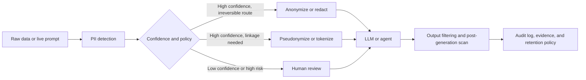
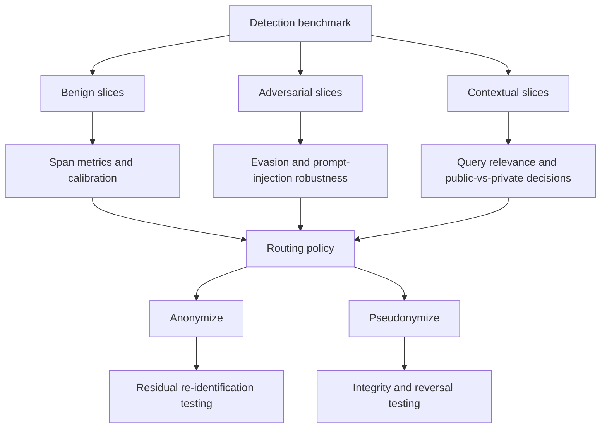

# PII Detection, Anonymization, and Pseudonymization for GenAI and Agentic Workflows

## Executive summary

Detection and transformation of sensitive data are now **system-level controls**, not just preprocessing steps. In GenAI and agentic workflows, personal data can leak at multiple points: model training and fine-tuning, prompt assembly, retrieval, tool outputs, memory, logs, observability systems, and model completions. Official guidance from the EDPB on LLM privacy risks, OpenAI, Anthropic, Google SAIF, and OWASP all converge on the same point: prompt injection, sensitive data disclosure, and over-broad agent permissions create new privacy attack surfaces that traditional “redact before storage” programs do not fully cover. citeturn28view2turn28view5turn28view3turn28view7turn4search0

The current detection landscape is fragmented and brittle. Domain benchmarks remain siloed, and when researchers unified ten public datasets into **PIIBench**, all eight published baseline systems scored **below 0.14 span-level F1**, with the best baseline still showing zero recall on most entity types. Meanwhile, **PII-Bench** shows that even strong LLMs can often identify PII in isolation but struggle to decide whether a piece of PII is **query-relevant** and therefore should or should not be masked in a live prompt. This is a central failure mode for LLM products: over-redaction breaks utility, while under-redaction leaks secrets. citeturn27view0turn27view1turn27view2turn27view3

Anonymization and pseudonymization should be treated as **two different product directions**. Under GDPR and EDPB guidance, pseudonymized data remains personal data unless the conditions for anonymity are actually met; the value of pseudonymization is risk reduction while preserving linkage, recontact, and longitudinal analysis. By contrast, anonymization aims to reduce identifiability so that release or reuse is safer without a reversal path, but that requires a much stronger residual-risk analysis than “remove direct identifiers.” ICO guidance, NIST de-identification guidance, TAB, and newer LLM-era anonymization research all underline that contextual clues, quasi-identifiers, and semantic re-identification matter as much as obvious identifiers. citeturn23view2turn25view0turn25view1turn3search20turn31view0turn31view1turn31view2

For enterprises, the practical implication is this: **use detection as a scored, auditable control**; then choose downstream action based on the required reversibility and utility. Use anonymization for external release, broad model-training corpora, or open research sets where re-identification is not needed. Use pseudonymization for customer support, healthcare research, internal analytics, agent memory, and longitudinal workflows where stable linkage must be preserved. The tools and evaluation methods needed for those two directions are materially different. citeturn25view4turn30view0turn32view0turn32view1

The biggest opportunity is not “one better detector.” It is an **end-to-end privacy control plane** for LLM and agentic systems: hybrid detection, calibrated uncertainty, policy-aware routing, reversible versus irreversible transforms, human review at uncertainty thresholds, and complete audit trails across prompt, memory, tool, and output channels. Existing benchmarks only partially measure this stack. citeturn29view1turn28view2turn26view6turn26view7turn6search9

## Scope, assumptions, and regulatory baseline

This report focuses primarily on **text and document-centric workloads** because that is where enterprise GenAI and agent systems are already concentrated: prompts, chat transcripts, tickets, emails, knowledge articles, logs, PDFs, native documents, call transcripts, and research notes. It also includes structured/tabular data where anonymization and pseudonymization are mature, and it notes multimodal concerns where official sources are strong, especially conversation transcripts, native documents, and DICOM imaging metadata. Because the target sectors were not specified, sector examples are treated as open-ended; healthcare, education, legal text, and general enterprise operations are used as the most evidence-rich cases. citeturn25view6turn29view3turn16search0turn31view0turn32view0

The core legal distinction is between **anonymization** and **pseudonymization**. EDPB guidance states that pseudonymized data is still personal data if it can be attributed to a person using additional information; the same guidance stresses that additional information must be kept separate and protected, and that pseudonymization reduces risk but does not itself take data outside GDPR unless the conditions for anonymity are truly met. ICO guidance is aligned: pseudonymization replaces or transforms identifying information and stores it separately, but it remains in scope of data protection law; anonymization requires an effective identifiability-risk assessment and supporting governance. citeturn23view2turn25view0turn25view1

For healthcare, HHS provides the official HIPAA de-identification guidance, and the HIPAA Security Rule separately requires **audit controls** for systems that contain or use ePHI. In practice, this means that privacy transformation is not enough on its own; covered entities also need logging, inspection, and governance for the systems handling protected data. For educational data, the U.S. Department of Education states that de-identified data may retain a **re-identification code** so long as the remaining information does not identify an individual and there is no reasonable basis to believe the recipient can identify the student from the code. FERPA also requires records of disclosures. citeturn16search1turn22search0turn22search4turn23view4turn22search3

California’s CCPA/CPRA framework also matters for enterprise data-sharing and research. The statute’s research-related provisions explicitly refer to data that is pseudonymized and deidentified, or deidentified and aggregated, and require technical safeguards that prohibit re-identification; the same statute also allows monitoring and compliance measures, including reviews, automated scans, and audits. In medical imaging, DICOM Part 15 provides attribute confidentiality profiles specifically to remove or replace attributes that could leak individually identifiable information while preserving data utility for intended use. citeturn23view0turn16search0turn16search12

A practical way to read these frameworks is that regulation is pushing toward **three requirements simultaneously**: high-recall detection, risk-appropriate transformation, and strong accountability artifacts. GDPR contributes the strongest explicit conceptual distinction between anonymization and pseudonymization; HIPAA contributes operational expectations for auditability; FERPA and DICOM show how reversibility and utility preservation are often legitimate requirements rather than exceptions. citeturn23view2turn25view0turn22search0turn23view4turn16search0

### Regulatory implications by transformation choice

| Framework | What matters most | Implication for anonymization | Implication for pseudonymization | Evidence |
|---|---|---|---|---|
| GDPR and EDPB | Identifiability risk, separation of additional information, privacy by design | Only effective anonymization can take data outside scope; mere removal of direct identifiers is not enough | Still personal data; useful safeguard under Articles 25 and 32 when additional information is kept separately | citeturn23view2turn18search4turn24search6 |
| ICO guidance | Effectiveness, motivated-intruder reasoning, governance | Requires documented risk assessment and release discipline | In scope of law; useful for research and analysis while reducing risk | citeturn25view0turn25view1 |
| HIPAA | Official de-identification guidance plus audit controls for ePHI systems | Appropriate for secondary use and sharing when de-identification standard is met | Common in practice for internal workflows, but audit/log controls still required around ePHI systems | citeturn16search1turn22search0turn22search4 |
| FERPA | Whether remaining data can reasonably identify a student; disclosure tracking | De-identified records may be shared if identifiability is sufficiently reduced | Re-identification codes are allowed in de-identified records if recipients cannot use them to identify students | citeturn23view4turn22search3 |
| CCPA/CPRA | Safeguards against re-identification; compliance monitoring | Deidentified and aggregated data can qualify for lower-risk uses | Research provisions explicitly contemplate pseudonymized/deidentified data plus safeguards and monitoring | citeturn23view0 |
| DICOM | Removal/replacement of image metadata while preserving intended utility | Strong fit for release of medical images and research sharing | Useful when linkage across imaging workflows is still needed internally | citeturn16search0turn16search12 |

### Why GenAI and agents raise the bar

Agentic systems widen the privacy boundary. OpenAI describes prompt injection as a frontier security challenge that emerges when AI can browse, access connected apps, and act on a user’s behalf; Anthropic makes the same point even more bluntly, arguing that agentic security requires defenses at every layer and careful limitation of which data and tools agents can access. Google SAIF similarly frames prompt injection and sensitive data disclosure as inherent risks of AI systems, with agentic systems amplifying the blast radius because the model may be granted access to email, files, tools, or even an entire computer. citeturn28view5turn28view3turn28view7

That changes requirements for privacy controls. In a classical batch NLP pipeline, detection errors mainly affect a data release or an internal dataset. In an agentic workflow, the same false negative can leak into a prompt, a tool call, a browser action, a memory store, or a completion returned to the user. And the same false positive can degrade task completion by removing facts that the model genuinely needs. This is why query-aware masking and confidence-aware routing are becoming as important as raw span extraction. citeturn27view2turn27view3turn25view7turn29view2

## Detection landscape

PII detection has matured into several product classes: rule-based and hybrid SDKs, managed cloud APIs, domain-specialized de-identification tools, and small local models built specifically for privacy filtering. The main enterprise need is not just “finding PII.” It is finding the **right** sensitive spans at the right confidence level across noisy, multilingual, semi-structured, or high-volume content, while integrating with LLM prompts, RAG pipelines, and agent toolchains. Official product documentation now reflects this shift: Google Sensitive Data Protection explicitly positions detection and de-identification for AI/ML workloads and generative AI prompts/responses; Microsoft Azure exposes text, conversation, and native-document PII workflows with masking and confidence scores; Azure also has an LLM output PII filter; and OpenAI’s Privacy Filter is explicitly targeted at high-throughput sanitization workflows that can run locally. citeturn25view2turn25view3turn25view6turn25view7turn26view0turn26view1

The strongest practical pattern today is **hybrid detection**. Presidio uses predefined or custom recognizers combining NER, regex, rule logic, checksums, and external models, and it supports text, images, and structured data. pyDeid follows a similar hybrid philosophy in healthcare, combining regexes, dictionaries, and optional NER, and it specifically exists because existing tools often lack generalization, speed, or affordability across health-system contexts. The evidence is consistent: fully generic off-the-shelf models struggle with domain shift, whereas single-domain systems do not generalize well enough for enterprise-wide privacy programs. citeturn29view0turn31view5turn27view1

A critical caution is that many detection tools still optimize for **token or span matching**, while real GenAI workflows need **contextual privacy decisions**. OpenAI states that Privacy Filter is designed to distinguish public information that should be preserved from private information relating to a private individual that should be masked. That aligns with the problem identified by PII-Bench: the hard part is often not finding a phone number or name, but deciding whether that span is contextually necessary to answer the user safely and correctly. citeturn26view0turn27view2turn27view4

### Representative detection tools

| Tool | Deployment and fit | Strengths | Main limits | Suitability for LLM or agent pipelines | Evidence |
|---|---|---|---|---|---|
| OpenAI Privacy Filter | Local / on-prem text sanitization model | Context-aware, single-pass token classification, open-weight, tunable, intended for high-throughput sanitization workflows | Text-focused, 8 output categories, primarily English with selected multilingual robustness eval only | Strong inline pre-prompt, pre-indexing, logging, and output-scan fit where local execution matters | citeturn26view0turn26view1 |
| Microsoft Presidio | Open-source SDK for text, image, and structured data | Extensible hybrid recognizers; customizability; image redaction; semi-automated and fully automated flows; evaluation tooling | Docs explicitly warn it cannot guarantee it will find all sensitive data; out-of-box accuracy must be evaluated and tuned | Very good as a policy layer and customizable gateway around LLM or RAG pipelines | citeturn29view0turn29view1 |
| Google Sensitive Data Protection | Managed cloud service with inspect + de-identify + pseudonymize | Built-in and custom infoTypes, thresholds, de-identification, tokenization, audit logging, positioned for AI/ML and GenAI prompts/responses | Cloud dependency, cost, and likely weaker nuanced social-context reasoning than model-based adjudication | Strong for governed enterprise pipelines and structured/unstructured batch flows | citeturn25view2turn25view3turn25view4turn30view0turn30view1 |
| AWS Comprehend Detect PII | Managed detection for plain text | Confidence scores, real-time location and async batch jobs, clear responsible-AI service card, entity taxonomy and threshold guidance | Text-only constraints are significant: fixed taxonomy, limited locale/language support, async-only redaction | Moderate fit for batch scrubbing and gating; weaker for rich document, multilingual, or native-file workflows | citeturn25view5turn29view2turn30view2 |
| Azure Language PII and Azure output PII filter | Managed text, conversation, native-document, and output filtering | Confidence scores, text/conversation/document variants, masking, transcript audio timing, async native-doc and conversation flows, LLM completion filtering | Azure documentation still frames output filtering as a flag-or-block safety layer rather than a full privacy governance system | Strong for copilot-style enterprise apps that need pre- and post-generation controls | citeturn25view6turn25view7turn29view3turn30view3 |
| pyDeid | Open-source healthcare de-ID | Fast, flexible, surrogate replacement, Canadian-specific extensions, benchmarked against comparable tools | Healthcare-specific; not a general enterprise privacy platform | Good for specialized clinical pipelines and research data preparation | citeturn31view5 |

### Benchmarks, datasets, and evaluation state

The benchmark picture is uneven. Clinical de-identification has mature shared tasks such as the **2014 i2b2/UTHealth challenge**, which used more than 1,300 patient records with surrogate PHI and withheld test data for evaluation. Text anonymization has **TAB**, which is much richer than standard de-identification benchmarks because it marks which spans should be masked to conceal identity, adds confidential attributes and coreference, and evaluates both privacy protection and utility preservation. Newer synthetic and cross-domain benchmarks are beginning to fill general-enterprise gaps, but they also reveal how hard generalization is. citeturn34view1turn31view0

**SPY** provides a synthetic PII detection benchmark generated with LLMs, while **PIIBench** unifies ten public datasets into 48 canonical PII entity types and shows that published systems generalize very poorly across sources. In education, recent studies use public datasets such as **CRAPII** and **TSCC** to evaluate LLM-assisted detection, and GPT-4 evaluations on MOOC forums found high recall but substantial over-redaction. Together these findings point to a simple conclusion: today’s benchmark leaders often reflect **narrow-domain or synthetic proficiency**, not robust enterprise readiness. citeturn26view2turn27view0turn27view1turn19search0turn34view3

A separate set of benchmarks matters for GenAI-native privacy. **PII-Bench** evaluates query-aware masking rather than basic extraction. **PrivLM-Bench** evaluates privacy leakage of language models under attack-oriented settings rather than only reporting differential privacy parameters. **PrivaCI-Bench** broadens privacy evaluation to contextual integrity and legal compliance, explicitly criticizing narrow PII-only formulations. For agents, **InjecAgent** and **AgentDojo** benchmark indirect prompt injection and exfiltration scenarios involving tools and untrusted content, while newer work such as **AgentLeak** argues that current benchmarks often miss internal channels like inter-agent messages and memory. citeturn27view2turn26view5turn26view6turn6search1turn27view5turn6search9

### Detection benchmarks and what they actually test

| Benchmark or dataset | Best for | What it measures well | What it misses | Evidence |
|---|---|---|---|---|
| i2b2 2014 de-identification | Clinical PHI detection | Health-note de-identification on longitudinal records with withheld test data | Non-clinical domains, multilinguality, agentic contexts | citeturn34view1 |
| TAB | Text anonymization | Residual identity concealment, confidential attributes, coreference, privacy–utility tradeoff | Real-time enterprise prompt gating and reversible pseudonymization | citeturn31view0 |
| SPY | Synthetic general PII detection | Open synthetic PII detection benchmarking | Real-world distribution shift and rare long-tail entities | citeturn26view2 |
| PIIBench | Cross-domain enterprise robustness | Cross-source label harmonization and generalization difficulty | Still text-only; benchmark is very new | citeturn27view0turn27view1 |
| PII-Bench | Query-aware masking for LLM prompts | Whether a model masks only query-irrelevant PII | Broad enterprise data modalities and downstream business utility | citeturn27view2turn27view4 |
| PrivLM-Bench | LM privacy leakage under attack | Membership inference and extraction-oriented privacy evaluation | System-pipeline risks such as prompt assembly and tool exposure | citeturn26view5 |
| PrivaCI-Bench | Contextual privacy and legal compliance | Contextual integrity and regulation-aware privacy reasoning | Exact span extraction and structured tokenization integrity | citeturn26view6 |
| InjecAgent and AgentDojo | Agentic data exfiltration and prompt injection | Indirect injection, tool abuse, attack success versus benign utility | Often limited inspection of internal memory and side channels | citeturn6search1turn27view5 |

### Enterprise and academic detection needs

Academic needs concentrate on **data sharing, secondary use, and reproducible benchmarking**. Healthcare research needs PHI removal or stable pseudonyms before sharing notes, images, or biosamples. Educational data mining needs accurate redaction of student forum posts and chat logs without destroying pedagogically relevant content. Legal and social-science text release needs concealment of identity cues beyond obvious names. These use cases benefit from openness, benchmarkability, and explainability, but they usually tolerate more batch processing and human review than live agents do. citeturn31view0turn32view0turn34view3turn31view6

Enterprise needs are broader and more operational. Common use cases include pre-prompt scrubbing for external model APIs, RAG indexing hygiene, customer-support transcript redaction, observability and log minimization, vendor-sharing controls, doc and transcript processing, and post-generation output filtering. These workflows often require strict latency envelopes, confidence thresholds, fallback behavior, and evidence that the control was applied. Official cloud documentation increasingly reflects those production needs through synchronous/asynchronous modes, masking thresholds, audit logs, and clear data-shape limits. citeturn25view2turn25view3turn29view2turn25view6turn29view3turn30view3

### Pain points and failure modes in detection

The first failure mode is **context ambiguity**. Names, places, or dates are not always private. Educational GPT-4 redaction studies showed heavy over-redaction of public figures, public places, and even mythical entities, hurting usefulness despite high recall. OpenAI’s Privacy Filter explicitly frames public-versus-private distinction as a key challenge. PII-Bench formalizes the same problem as query relevance. citeturn34view3turn26view0turn27view2

The second failure mode is **distribution shift** across domain, locale, and modality. AWS explicitly notes that OCR artifacts, speech-transcription errors, locale variation, and confounding variation all affect performance and should be part of customer evaluation. Azure distinguishes text, conversation, and native-document modes because conversation structure and file layout change error patterns. Recent multilingual work further argues that low-resource locales and long-tail local entity types remain under-covered by standard NER or zero-shot LLM solutions. citeturn29view2turn25view6turn29view3turn8search3

The third failure mode is **benchmark mismatch**. Presidio’s own documentation emphasizes that no de-identification system is perfect and recommends use-case-specific evaluation; its evaluation docs also emphasize F2 when recall matters more. PIIBench then shows how badly systems can degrade when labels and sources are harmonized. That gap between vendor or single-dataset scores and multi-source generalization is one of the clearest opportunities in the space. citeturn29view0turn29view1turn27view1

The fourth failure mode is **adversarial robustness**. Google SAIF calls out prompt injection, sensitive data disclosure, multimodal injection, and even evasive attacks using homoglyphs or hidden content. AgentDojo and InjecAgent show that tool-integrated agents remain vulnerable to exfiltration and action hijacking through untrusted data returned by tools or external content. This means that detector evaluations should not stop at benign text corpora. They need adversarial and agentic test suites. citeturn28view7turn27view5turn6search1

## Anonymization after detection

Anonymization is the right downstream direction when the organization wants to **remove the need for reversal** and make broader sharing or model use safer. But in practice, anonymization is harder than “mask all detected spans.” NIST’s de-identification guidance emphasizes that stronger manipulative transformations often reduce utility, and TAB was created precisely because standard de-identification benchmarks do not tell you whether a document still exposes identity through contextual clues, coreference, or confidential attributes. ICO guidance likewise treats anonymization as an effectiveness problem, not a checkbox. citeturn3search20turn31view0turn25view0

For academic use, anonymization is often the preferred direction for **open release or broad sharing** of corpora, legal texts, MOOCs, and de-identified research datasets. For enterprises, anonymization is usually best for training corpora, analytics extracts, third-party sharing, or long-term archival sets where re-identification is not operationally needed. In both cases, the transformation must be assessed against a realistic re-identification threat model that includes public web data, organizational context, and LLM-assisted inference. citeturn31view0turn28view2turn3search20

Modern text anonymization research increasingly treats this as a **privacy–utility optimization problem**. The ACL 2025 work on robust utility-preserving text anonymization explicitly frames LLM-era anonymization as a balance between protection against LLM-based re-identification and downstream utility. The 2026 Expert Systems with Applications paper argues that objective evaluation should jointly assess privacy protection and utility preservation and reports that LLM-based methods can outperform earlier NER-based or PPDP-oriented methods on that tradeoff. Those are promising results, but they do not remove the need for rigorous residual-risk evaluation. citeturn31view1turn31view2

### Where anonymization fits best

| Use case | Why anonymization fits | Key requirements | Main risk if done poorly | Evidence |
|---|---|---|---|---|
| Open research corpora and shared benchmarks | No later reversal should be needed | Residual identity risk must be low even with auxiliary information | Linkage or semantic re-identification | citeturn31view0turn3search20 |
| Training corpora for LLM fine-tuning or indexing | Lower chance of memorization or later leakage | Very high recall on direct identifiers plus broader quasi-identifier treatment | Training-data extraction or cue-based reconstruction | citeturn28view1turn31view1 |
| Legal or public-document release | Identity may be inferable from context | Coreference, confidential attributes, and public-record linkage matter | Identity leakage even after direct redaction | citeturn31view0 |
| Vendor or analytics sharing | Reversal often unnecessary | Stable utility targets and documented re-identification testing | Over-redaction harms utility; under-redaction leaks customer data | citeturn25view0turn31view2 |

### Anonymization tools and approaches

| Approach or tool | Strengths | Weaknesses | Best fit | Evidence |
|---|---|---|---|---|
| Basic redaction or masking | Simple, cheap, auditable | Often preserves enough context for re-identification; utility loss can be high | Quick internal minimization before model calls | citeturn25view3turn29view0 |
| Surrogate replacement | Better readability and downstream utility | If poorly managed, can preserve or create linkability | Research data and human-readable corpora | citeturn31view5turn31view0 |
| LLM-based rewrite anonymization | Better semantic/contextual handling and privacy–utility tradeoff in recent papers | Harder to bound, requires attack-based evaluation, can hallucinate | High-value text release with human review | citeturn31view1turn31view2 |
| ARX | Mature structured-data anonymization, privacy/risk models, utility analysis | Not built for free text or inline agent prompts | Tabular microdata release | citeturn33search3turn33search6 |
| sdcMicro | Statistical disclosure control and risk estimation for microdata | Structured-data focus; not an LLM privacy gateway | Official statistics, survey microdata, research files | citeturn33search1turn33search16turn33search19 |
| Amnesia | Formal guarantees with k-anonymity and km-anonymity, user-friendly | Structured/transactional focus and weaker fit for dynamic text workflows | Public release of relational or transactional datasets | citeturn33search2turn33search5turn33search17 |

The main pain point in anonymization evaluation is that **detection metrics are insufficient**. A system can have excellent span-level F1 and still leave a document identifiable through timing, geography, unusual events, social relations, or coreference chains. TAB is valuable because it explicitly measures more than surface redaction. For enterprise GenAI, the same principle applies: a sanitized prompt or document should be evaluated under red-team attempts, retrieval linking, and LLM-assisted inference, not only exact span match. citeturn31view0turn28view1turn28view2

My practical assessment is that anonymization is currently more mature for **structured data release** than for **free-form text in live enterprise systems**. The structured-data toolchain has strong privacy models and utility metrics. Free-text anonymization is improving quickly, especially with LLM-based rewriting, but residual-risk measurement is still underdeveloped and human review remains essential for high-stakes release decisions. That assessment is supported by the literature, though it is partly an inference based on the relative maturity of ARX/sdcMicro/TAB versus the newer LLM-anonymization papers. citeturn33search3turn33search1turn31view0turn31view1turn31view2

## Pseudonymization after detection

Pseudonymization is the right downstream direction when the organization must **hide direct identifiers from most processing paths while preserving stable linkage**. That makes it a natural fit for research cohorts, customer analytics, case management, experiment tracking, memory-enabled assistants, and any workflow where humans or downstream systems may need to reconnect the transformed record to the original subject under controlled conditions. EDPB explicitly notes that pseudonymization enables linkage of various records relating to the same person without using additional information during ordinary processing, while reversal should be limited to specifically authorized persons. citeturn23view2

This is especially important for LLM and agentic systems. A useful pattern is to keep real names, emails, and account numbers outside the model context, but replace them with **stable surrogate IDs** so the model can still reason over chronology, ownership, case continuity, or multi-turn memory. In other words, pseudonymization can be a better fit than anonymization for agent memory and enterprise copilots because it preserves continuity without exposing raw identifiers to the model. That is consistent with EDPB’s explanation of pseudonymization as a safeguard that reduces risks while allowing general analysis. citeturn23view2turn25view1

Operationally, pseudonymization requires **much more infrastructure discipline** than simple redaction. Google’s Sensitive Data Protection docs lay out the major implementation choices: one-way versus two-way tokens, deterministic encryption, cryptographic hashing, format-preserving encryption for legacy systems, re-identification support, context-specific tweaks, and key-management choices. The docs also make clear that reversibility, referential integrity, and key isolation are first-class design variables. If those are not governed carefully, a pseudonymization program can become little more than lightly hidden personal data. citeturn25view4turn30view0turn30view1

### Where pseudonymization fits best

| Use case | Why pseudonymization fits | Core technical need | Main risk | Evidence |
|---|---|---|---|---|
| Longitudinal healthcare research | Stable cross-visit and cross-source linkage with restricted re-identification | Referential integrity plus controlled depseudonymization | Key or lookup-table compromise | citeturn32view0turn32view1turn23view2 |
| Enterprise support and CRM analytics | Stable case/entity tracking without exposing raw IDs to models or analysts | Deterministic tokens and policy-based access to originals | Hidden joinability via quasi-identifiers | citeturn25view4turn30view0 |
| Agent memory and multi-turn copilots | Preserve continuity while minimizing direct identifier exposure in context windows | Stable surrogates and strict authorization for reversal | Memory-store leakage or cross-session linking | citeturn23view2turn28view5turn28view7 |
| Multi-center studies and biosample management | Sites need linkage without broad identity exposure | Cross-site identity management and secure identifier issuance | Rollout complexity and interoperability failure | citeturn32view0turn32view1 |

### Representative pseudonymization options

| Tool or pattern | Strengths | Weaknesses | Best fit | Evidence |
|---|---|---|---|---|
| Google Sensitive Data Protection deterministic tokens | Reversible, referentially consistent, supports re-identification, strong key-management patterns | Cloud-centric, KMS and context management complexity | Enterprise systems needing stable tokens across services | citeturn25view4turn30view0turn30view1 |
| Google FPE tokenization | Preserves length and alphabet for legacy systems | Docs warn it can be slow and less flexible than deterministic encryption | Legacy systems with strict format constraints | citeturn30view0 |
| One-way cryptographic hashing | Strong irreversible pseudonymization-like behavior for some use cases | No reversal; utility limited if you later need recontact | Risk reduction where reversal must be impossible | citeturn30view0turn30view1 |
| OPT | Rapid deployment across heterogeneous institutions; practical scale demonstrated in a live research network | Office-suite architecture gives weaker confidentiality/integrity/availability guarantees than full client-server systems | Large but operationally constrained research networks | citeturn32view1 |
| gPAS, Mainzelliste, EUPID class of tools | Better fit for mature multi-center research infrastructures | Can be operationally heavy and slower to roll out; central services may be unusable without consent in some settings | Larger long-term research platforms | citeturn32view0turn32view1 |

The strongest evidence on pseudonymization pain points comes from biomedical research. The 2025 systematic review found a heterogeneous tool landscape and evaluated tools across four dimensions: single-center versus multi-center, short-term versus long-term, small data versus big data, and integration versus standalone use. The review concludes that tool choice is highly project-dependent and that no one tool fits every setting. The OPT study adds a concrete operational gap: many existing tools are too hard to roll out quickly across institutions, especially when central services are infeasible or consent is missing for that processing mode. citeturn32view0turn32view1

The biggest enterprise lesson is that pseudonymization must be evaluated not only for privacy but also for **business correctness**. If the same customer acquires multiple tokens across systems, case continuity breaks. If deterministic tokens are too widely shared, unauthorized joins become easy. If the vault or key domain is mis-scoped, the organization has created a single high-value target. EDPB’s concept of a pseudonymization domain is useful here: define exactly who can process pseudonymized data, who can access additional information, and what means of attribution are realistically available inside and outside that domain. citeturn23view2turn25view4

## Evaluation gaps and recommended research program

The current measurement stack has four major gaps.

The first gap is **calibration and uncertainty quantification**. Most products return scores or confidence thresholds, but the literature and product docs still emphasize precision, recall, and F-scores much more than calibrated probabilities. For production privacy programs, teams need to know whether a score of 0.82 means the same thing for emails, person names, OCR text, and multilingual addresses. Without calibration, confidence-based human review policies are fragile. citeturn29view1turn29view2turn30view3

The second gap is **contextual masking evaluation**. PII-Bench shows that the hard problem in LLM applications is often deciding what to suppress while preserving task utility. Most classic datasets are not built for that. This is why so many enterprise teams end up with crude “mask everything” pipelines that damage retrieval quality, summarization fidelity, or agent task success. citeturn27view2turn27view3

The third gap is **end-to-end agentic privacy evaluation**. AgentDojo and InjecAgent provide realistic attack settings, but the benchmark ecosystem is still young, and newer work such as AgentLeak argues that output-only audits miss privacy leaks in internal channels such as multi-agent messages, shared memory, and tool arguments. For enterprise agents, that is not a side issue; it is the main privacy surface. citeturn27view5turn6search1turn6search9

The fourth gap is **separate evaluation of anonymization and pseudonymization**. Anonymization should be scored by residual re-identification risk and utility preservation; pseudonymization should be scored by unauthorized irreversibility, authorized reversibility, referential integrity, and blast radius under key compromise. Today, many tool evaluations still collapse these into generic “redaction quality” or “de-identification accuracy” metrics. citeturn31view0turn32view0turn30view0

### Recommended evaluation program

| Proposed evaluation | Threat scenario | Core metrics | Success criteria | Notes |
|---|---|---|---|---|
| Detection robustness suite | Benign text plus OCR noise, transcript errors, locale variation, public/private ambiguity | Span precision, recall, F2, subgroup recall gaps, partial-overlap score, latency, cost | For high-risk entities, very high recall with bounded subgroup gaps; explicit abstain-to-review behavior on uncertain slices | Build from PIIBench-style harmonization plus enterprise slices | 
| Query-aware masking suite | User asks a task that includes both necessary and unnecessary PII in prompt context | PII relevance precision/recall, answer quality delta, over-redaction rate | Preserve task success while removing all query-irrelevant sensitive data | Extend PII-Bench with RAG and multi-document cases |
| Anonymization attack suite | Adversary has web search, public records, LLM-based inference, and document context | Red-team re-identification success rate, utility loss on downstream tasks, human readability, coreference consistency | Residual attack success below pre-set threshold with acceptable utility loss | Use TAB-style labels plus modern LLM adversaries |
| Pseudonymization integrity suite | Insider or attacker tries to join, reverse, or collide tokens; authorized users must re-identify correctly | Unauthorized reversal rate, authorized reversal success, collision rate, referential integrity, key-rotation resilience | Zero unauthorized reversals in harness; 100% linkage correctness on reference joins | Essential for agent memory and analytics warehouses |
| Agentic leakage suite | Prompt injection, tool-result poisoning, memory exfiltration, output leakage, log/trace leakage | Attack success rate, benign task success, leak volume by channel, time to human escalation | Critical flows should drive attack success close to zero without large benign utility loss | Measure prompt, memory, tool, output, and observability channels together |

These proposed evaluations should be run with **paired comparisons** wherever possible. When comparing two detectors or two transformation policies on the same positives, paired evaluation dramatically improves statistical efficiency compared with independent samples. For binary rates such as recall or attack success, sample-size planning can follow the NIST guidance for proportions: roughly **1,067** observations estimate a proportion at 95% confidence with about ±3 percentage points at worst-case uncertainty; if the target is high recall, about **753 positive examples** estimate a recall near 0.98 with about ±1 percentage point; about **1,522 positive examples** estimate a recall near 0.99 with about ±0.5 percentage points under the simple normal approximation. For high-stakes classes, these counts should apply **per slice** rather than only overall. citeturn15search0turn15search3

In practice, that means rare entities cannot be evaluated through naive random sampling. Teams should use **stratified enrichment** for low-frequency classes such as secrets, account numbers, biosample IDs, or locale-specific identifiers, and then report both enriched-slice performance and prevalence-weighted operational estimates. The same principle applies to adversarial testing: prompt-injection and exfiltration attacks are rare in benign traffic, so privacy evaluation needs explicit adversarial scenario sets rather than waiting for natural occurrence. citeturn29view2turn27view5turn6search1

Human review should be built in as a measurable component, not treated as a vague fallback. AWS explicitly recommends assessing the need for human oversight, Azure output filtering allows flagging or blocking, and OpenAI’s guidance for safer agent behavior stresses confirmation before consequential actions. A strong evaluation program should therefore measure **review workload**, **inter-reviewer agreement**, **time to adjudication**, and **the privacy/utility lift from HITL** on uncertain or high-risk slices. citeturn29view2turn25view7turn28view5

### Recommended visualizations

| Visualization | What it should show | Why it matters |
|---|---|---|
| Privacy–utility Pareto chart | Residual risk versus downstream utility for anonymization strategies | Makes the core tradeoff visible and discourages single-score thinking |
| Reliability diagram | Predicted confidence versus empirical correctness by entity type and slice | Reveals whether thresholds for human review are trustworthy |
| Agent leakage Sankey | Prompt, retrieval, tool, memory, output, and log channels with leak counts or probabilities | Forces end-to-end visibility across the full agent stack |
| Threshold curve | Recall, precision, review rate, and latency as confidence threshold changes | Helps choose operating points for live systems |
| Slice heatmap | Performance by domain, locale, OCR quality, modality, and entity type | Prevents an apparently strong overall score from hiding failure pockets |

### Unbiased assessment of market and research maturity

There is real progress, but the field is **not yet mature enough to trust “single-score vendor claims” for GenAI privacy controls**. Product documentation is useful for capabilities, limits, and integration patterns. Peer-reviewed and shared benchmarks are better for comparative judgment. The clearest bias to watch is that vendor benchmarks often evaluate on favorable taxonomies, preferred datasets, or product-specific operating points. The most credible procurement or architecture decision process should therefore combine official vendor docs with neutral benchmarking on internal content and with at least one cross-domain public suite such as PIIBench or agentic adversarial suites such as AgentDojo or InjecAgent. citeturn26view0turn29view2turn29view1turn27view1turn27view5turn6search1

## Open questions and limitations

This report is strongest on **text, documents, healthcare, education, and agentic text workflows**. It is less complete on video, biometric, and speech-anonymization research, on sector-specific financial regulations beyond general enterprise practice, and on commercial vendors whose official technical documentation is weaker or more marketing-oriented than the sources cited here. citeturn29view3turn16search0turn32view0

A second limitation is that several of the most interesting general-enterprise benchmarks are **very new**. PIIBench, GLiNER2-PII, and some agentic leakage benchmarks are recent enough that independent replication and broader community adoption are still limited. Those newer sources are still useful because they identify real failure modes, but they should not yet be treated as settled standards. citeturn27view0turn9search6turn6search9

The most actionable open question for product teams is not “which detector is best?” It is this: **what is the operating policy when the detector is uncertain or when utility and privacy conflict?** That policy decision determines whether the right downstream direction is anonymization, pseudonymization, or human review, and it should be made explicitly, with measured thresholds, not implicitly inside prompts or vendor defaults. citeturn29view1turn29view2turn25view7turn23view2